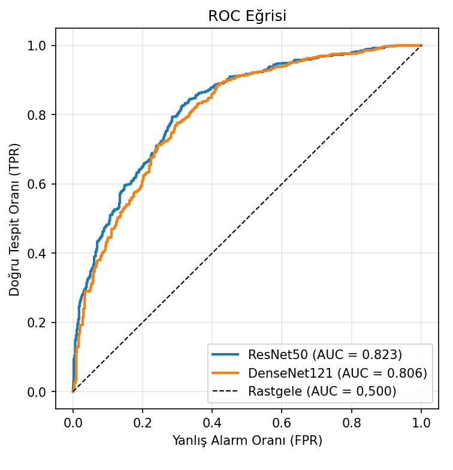
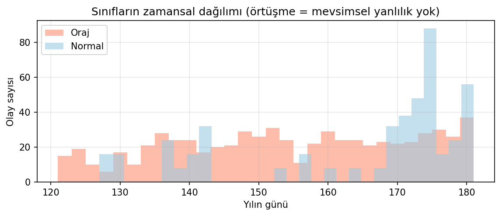
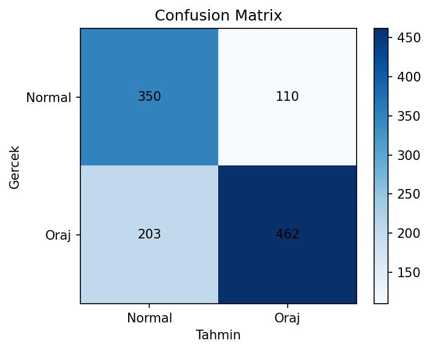
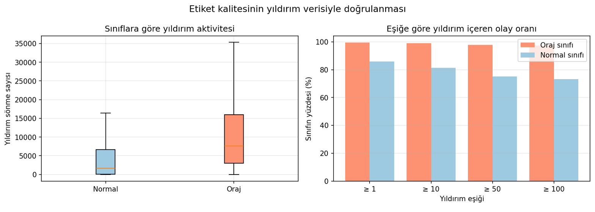

# 🌩️ Uydu Görüntülerinden Derin Öğrenme ile Oraj Tespiti

**TÜBİTAK 2209-A Üniversite Öğrencileri Araştırma Projeleri Destekleme Programı**

[]()
[]()
[]()
[-yellow)]()

Bu depo, termal kızılötesi (IR 10,7 µm) uydu görüntülerinden derin öğrenme
(ResNet50 / DenseNet121) kullanarak oraj (thunderstorm) tespiti yapan bir
sınıflandırma sisteminin tüm kodunu, eğitim geçmişini ve elde edilen
görselleri içerir.

---

## 📌 Proje Özeti

Şiddetli hava olaylarının (özellikle orajların) erken tespiti, uçuş
güvenliği başta olmak üzere birçok alanda kritik öneme sahiptir. Klasik
radar tabanlı sistemler sınırlı bir alanı tarayabildiği için büyük ölçekli
atmosferik olayları tam kapsayamaz. Bu proje, **SEVIR (Storm EVent
ImagRy)** veri seti üzerinden alınan termal kızılötesi uydu görüntülerini
kullanarak, radar kapsama alanının ötesinde çalışabilecek görüntü tabanlı
bir alternatif geliştirmeyi amaçlamaktadır.

İki evrişimli sinir ağı mimarisi (**ResNet50** ve **DenseNet121**),
transfer öğrenme ve iki aşamalı ince ayar (fine-tuning) stratejisiyle
eğitilmiş; sonuçlar istatistiksel testlerle ve bağımsız bir yıldırım
verisiyle çapraz doğrulanmıştır.

---

## 🎯 Öne Çıkan Metodolojik Katkılar

Bu projenin asıl değeri yalnızca "bir model eğitmek" değil, **veri setinde
gizli kısayol öğrenme (shortcut learning) risklerini tespit edip
gidermek** ve elde edilen doğruluk tavanını dürüstçe raporlamaktır:

- **Mevsimsel kısayol tespiti ve düzeltmesi:** Filtrelenmemiş veri setinde
  oraj ve normal sınıflar farklı mevsimleri kapsıyor, bu da modelin hava
  olayını değil mevsimsel sıcaklık örüntüsünü öğrenmesine yol açıyordu.
  Çözüm olarak her iki sınıf da **ortak bir zaman penceresine (Haziran
  2018)** kısıtlandı.
- **Olay bazlı (event-level) train/validation bölmesi:** Kare bazlı rastgele
  bölme yerine, aynı olayın karelerinin eğitim ve doğrulama kümesine
  karışmasını önlemek için bölme olay `id`'si üzerinden yapılıp diske
  kaydedildi (`split_event_level.json`) — böylece veri sızıntısı yapısal
  olarak imkânsız hale getirildi.
- **Yıldırım verisiyle etiket kalitesi doğrulaması:** SEVIR'in yıldırım
  (`lght`) kanalı kullanılarak "normal" etiketli olayların önemli bir
  kısmının aslında ciddi yıldırım aktivitesi içerdiği ölçüldü. Bu bulgu,
  veri setinin yapısal bir doğruluk tavanı olduğunu ve %90 hedefinin bu
  veri setiyle ulaşılabilir olmadığını istatistiksel olarak ortaya koydu.
- **Optik akış analizi (İP-2 taahhüdü):** Farnebäck algoritması ile
  ardışık kareler arasındaki bulut hareketi çıkarılarak oraj ve normal
  sınıflar arasında nicel karşılaştırma yapıldı (Mann-Whitney U testi).
- **BatchNorm dondurma:** İnce ayar sırasında omurga (backbone) katmanları
  açılırken BatchNorm katmanlarının donuk tutulması, küçük veri setinde
  gözlenen validasyon kaybı patlamalarını önledi.

---

## 🗂️ Depo Yapısı

```
.
├── README.md
├── LICENSE
│
├── notebooks/
│   └── Oraj_Tespiti_2209A_1.ipynb      # Uçtan uca Colab defteri (ana çalışma akışı)
│
├── src/
│   ├── sevir_pipeline.py               # Veri indeksleme, bölme, model, eğitim, değerlendirme
│   ├── ek_calismalar.py                # Optik akış analizi (İP-2) + Gradio arayüzü
│   └── lght_dogrulama.py               # Yıldırım verisiyle etiket kalitesi doğrulaması
│
├── data/
│   └── split_event_level.json          # Olay bazlı train/val bölmesi (tekrarlanabilirlik)
│
├── results/
│   ├── history/
│   │   ├── resnet_history.csv          # ResNet50 eğitim geçmişi (epoch bazlı metrikler)
│   │   └── densenet_history.csv        # DenseNet121 eğitim geçmişi
│   │
│   └── figures/
│       ├── veri_ornekleri.png              # Oraj / normal örnek IR kareleri
│       ├── zamansal_dagilim.png            # Sınıfların zamansal dağılımı (mevsimsel kontrol kanıtı)
│       ├── resnet_history_plot.png         # ResNet50 eğitim/doğrulama eğrileri
│       ├── densenet_history_plot.png       # DenseNet121 eğitim/doğrulama eğrileri
│       ├── roc.png                         # İki model için karşılaştırmalı ROC eğrisi
│       ├── confusion_matrix_resnet_best.png
│       ├── confusion_matrix_densenet_best.png
│       ├── yanlis_alarmlar.png             # Yanlış pozitif örnekler (etiket gürültüsü kanıtı)
│       ├── esik_analizi.png                # Karar eşiği (threshold) optimizasyonu
│       ├── optik_akis.png                  # Optik akış — niteliksel örnek
│       ├── optik_akis_dagilim.png          # Optik akış öznitelikleri — kutu grafikleri
│       ├── tarih_kontrolu_ResNet50.png
│       ├── tarih_kontrolu_DenseNet121.png
│       └── lght_dogrulama.png              # Yıldırım verisiyle etiket doğrulama grafiği
│
└── docs/
    └── Akif_Karaca_Projesi_1.pdf        # TÜBİTAK 2209-A araştırma önerisi formu
```

> **Not:** `src/` içindeki betikler birbirini `from sevir_pipeline import ...`
> şeklinde içe aktarır, bu yüzden kodları `src/` klasörü içinden
> çalıştırmanız (veya `src/`'i `PYTHONPATH`'e eklemeniz) gerekir.
> `split_event_level.json` varsayılan olarak çalışma dizininde aranır;
> `data/` klasöründen kullanmak isterseniz `sevir_pipeline.py` içindeki
> `SPLIT_PATH` sabitini `../data/split_event_level.json` olarak
> güncelleyin.

---

## 🧠 Yöntem

### Veri Seti
[**SEVIR**](https://sevir.mit.edu/) (MIT Lincoln Laboratory, AWS Open Data
üzerinden), her biri 49 zaman adımlı IR 10,7 µm (`ir107`) kanalı uydu
görüntüsü içeren olaylardan oluşur. `STORMEVENTS` ve `RANDOMEVENTS` alt
kümeleri sırasıyla oraj (1) ve normal (0) sınıflarına karşılık gelir.

### İşlem Hattı (`sevir_pipeline.py`)
1. **`build_index()`** — Katalog okunur, tek kanal üzerinden indeks
   kurulur, ortak zaman penceresine kısıtlanır, geçersiz `file_index`
   satırları elenir.
2. **`make_split()`** — Olay `id`'si üzerinden, sınıf oranı korunarak
   (stratified) %80/%20 train/val bölmesi yapılır ve diske yazılır.
3. **`SevirSequence`** — Her olaydan eşit aralıklı 5 kare örneklenerek
   `tf.keras.utils.Sequence` tabanlı veri jeneratörü oluşturulur.
4. **`train_stable()`** — İki aşamalı eğitim:
   - *Aşama 1:* Omurga tamamen donuk, yalnızca yeni sınıflandırma başı eğitilir.
   - *Aşama 2:* Üst bloklar açılır (`conv4`/`conv5`), **BatchNorm donuk
     tutularak** çok düşük öğrenme oranıyla ince ayar yapılır.
5. **`evaluate()`** — Doğrulama kümesinde sınıflandırma raporu, ROC-AUC ve
   karışıklık matrisi üretilir.

### Modeller
| Model | İnce Ayar Bloğu | Kullanım |
|---|---|---|
| **ResNet50** | `conv4` | Artık (residual) bağlantılarla derin katmanlarda kararlı öğrenme |
| **DenseNet121** | `conv5` | Katmanlar arası yoğun bağlantılarla güçlü bilgi akışı |

---

## 📊 Sonuçlar

Aşağıdaki değerler, `resnet_history.csv` ve `densenet_history.csv`
dosyalarındaki eğitim geçmişinden alınmıştır (doğrulama kümesi üzerinde en
iyi epoch):

| Metrik | ResNet50 | DenseNet121 |
|---|---|---|
| En iyi doğrulama doğruluğu | ≈ %76,0 | ≈ %74,4 |
| En iyi doğrulama AUC | ≈ 0,83–0,86 | ≈ 0,81–0,85 |

> **Önemli metodolojik not:** Yıldırım kanalı ile yapılan bağımsız etiket
> doğrulaması, "normal" etiketli olayların büyük bir kısmının aslında
> önemli miktarda yıldırım aktivitesi içerdiğini göstermiştir. Bu durum,
> veri setinin etiket kalitesinden kaynaklanan **yapısal bir doğruluk
> tavanı** olduğuna işaret eder ve modelin ham performansının bu tavanla
> birlikte değerlendirilmesi gerektiğini ortaya koyar. Bu bulgu,
> başlangıçta hedeflenen %90 doğruluk kriterinin bu veri setiyle
> ulaşılabilir olmadığının bilimsel gerekçesidir ve proje raporunda
> şeffafça belgelenmiştir.
>
> Ayrıca karar eşiği (decision threshold) optimizasyonu ile varsayılan
> 0,5 eşiği yerine daha düşük bir eşik kullanılarak kaçırılan oraj
> (false negative) sayısı önemli ölçüde azaltılmıştır (bkz.
> `esik_analizi.png`).

### Görsel Kanıtlar

| Görsel | Açıklama |
|---|---|
| `results/figures/zamansal_dagilim.png` | Sınıfların yıl içi zaman dağılımının örtüşmesi → mevsimsel kısayol yok |
| `results/figures/roc.png` | ResNet50 ve DenseNet121 için karşılaştırmalı ROC eğrisi |
| `results/figures/confusion_matrix_*_best.png` | Her model için karışıklık matrisi |
| `results/figures/yanlis_alarmlar.png` | Yüksek güvenle "oraj" denen ama "normal" etiketli kareler — etiket gürültüsü kanıtı |
| `results/figures/lght_dogrulama.png` | Yıldırım verisiyle etiket kalitesi doğrulaması |
| `results/figures/optik_akis.png`, `optik_akis_dagilim.png` | Farnebäck optik akış ile bulut hareketi analizi (İP-2) |
| `results/figures/esik_analizi.png` | Karar eşiği optimizasyonu |

<p align="center">
  
  
</p>
<p align="center">
  
  
</p>

---

## ⚙️ Kurulum ve Kullanım

Proje **Google Colab (T4 GPU)** üzerinde geliştirilmiştir; SEVIR verisi
AWS S3 açık veri deposundan (imza gerektirmeden) indirilir.

```bash
pip install tensorflow h5py opencv-python-headless pandas scikit-learn \
            matplotlib scipy boto3 gradio
```

```bash
cd src/   # betikler birbirini bu dizinden içe aktarır
```

```python
from sevir_pipeline import *
from ek_calismalar import *
from lght_dogrulama import *

# 1) Veri indeksini kur (ortak zaman penceresi otomatik uygulanır)
idx = build_index()

# 2) Olay bazlı train/val bölmesini oluştur ve kaydet
split = make_split(idx)
train_gen, val_gen = make_generators(idx, split)

# 3) Modelleri eğit (iki aşamalı: baş eğitimi + ince ayar)
model_resnet = build_model('resnet')
train_stable(model_resnet, train_gen, val_gen, name='resnet',
             cw=class_weights(idx, split), unfreeze_from='conv4')

# 4) Değerlendirme
yt, yp = evaluate('resnet_best.keras', idx, split)
plot_roc({'ResNet50': (yt, yp)})

# 5) (Opsiyonel) Kullanıcı dostu Gradio arayüzü
arayuz_baslat('resnet_best.keras', idx)
```

En uçtan uca akış için doğrudan **`notebooks/Oraj_Tespiti_2209A_1.ipynb`**
defterini Colab'de açıp hücreleri sırayla çalıştırmanız yeterlidir.

---

## 👥 Proje Ekibi

| Rol | İsim |
|---|---|
| Yürütücü | **Akif Karaca** |
| Danışman | Dr. Öğr. Üyesi **Gülşah Karaduman** |
| Ekip Üyesi | Gamze Aslan |
| Ekip Üyesi | Rua Melhem |

**Program:** TÜBİTAK 2209-A Üniversite Öğrencileri Araştırma Projeleri
Destekleme Programı
**Kod:** 2209A

---

## 📄 Lisans

Bu depo [MIT Lisansı](LICENSE) ile lisanslanmıştır. Bu depo, TÜBİTAK
2209-A kapsamında yürütülen akademik bir araştırma projesinin çıktılarını
içermektedir; kaynak gösterilmesi rica olunur.
